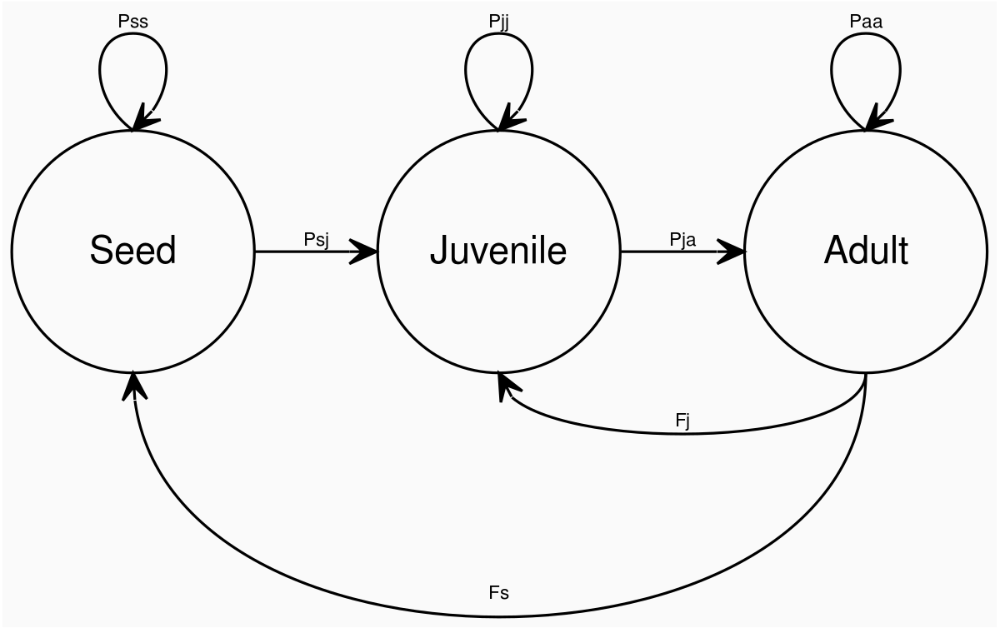
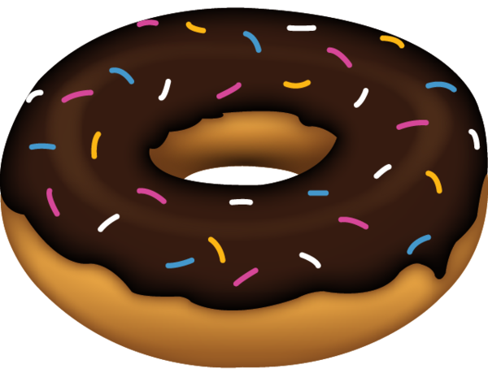

# DisturPloidy (v0.0.1)

**An Individual-Based Model (IBM) written in R.**

This model simulates plant populations over time in order to try and understand the prevalance of genome duplication (polyploidy) that we see in flowering plants (angiosperms). In particular it focuses on one specific question: 

> *How does disturbance on a landscape affect the establishment of new polyploid plant species?*

By simulating, genetically explicit individuals (plants), on a landscape which can be disturbed, this model can be used to test which of the core benefits and costs to polyploidy most effect their establishment patterns in disturbed versus undisturbed environments.

## Installation

From your R console:

```R
install.packages("devtools")
library(devtools)
install_github("rosemckeon/ploidy")
library(disturploidy)
```

## Basic usage

From your R console/script running `disturploidy()` without parameters will run a quick simulations (ten generations) where no whole-genome duplication/distrubance occurs. You can turn these on with `ploidy_prob` and `disturbance_freq` respectively. By default polyploids that arise will incurr no costs/benefits from this mutation. See `?disturploidy` for more details on model parameters which can be used to tailor these values, extend generations and alter the output format.

## Dependencies

The model requires Devtools, Tidyverse and Tictoc to run. They will be installed with disturploidy, but not loaded. Make sure to load them:

```
library(devtools)
library(tidyverse)
library(tictoc)
```

## Advanced usage

You can also set simulations running on a server without entering an R console. Running simulations with BASH commands means you can automate processes to continuously run simulations if you so desire. For more details see [here](https://github.com/rosemckeon/ploidy-data).

## Output

By default, model data is stored to an environment object (every generation) which can be loaded on completion by doing `data(dploidy)` from your R console. This file is overwritten everytime you run `disturploidy()` but you can specify a `filename` and/or `logfilename` to store information more permanently. Alternatively you can set `return = T` to output the data straight to console or assign it to your own objects.

## The model system

Every generation there is:

1. **Survival** of juveniles and adults.
1. **Germination** followed by possible seed survival.
3. **Growth** of juveniles and adults.
4. **Competition** between adults for resources.
5. **Reproduction** of adults and seed dispersal.

The life cycle of the plants in this model can be tailored to suit various life history strategies.

<figure>


  
<figcaption>
  
**Figure 1: Disturploidy Life Cycle Graph.** Individual plants in this model are represented by three life stages (seeds, juveniles and adults). Between generations, all individuals can remain at their current life stage or transition to the next. There is no back transitioning capability built into the model, so herbivory for instance is not considered.

</figcaption>
</figure>

### Transition probabilities

#### Probability of remaining a seed (Pss)

```
Pss = probability of failing to germinate * chance of landing where there are adults * probability of seed survival
```
Seeds may fail to germinate due to chance, or because they land where adults are established.

Parameters: `germination_prob`, `seed_survival_prob`

#### Probability of transitioning from a seed to a juvenile (Psj)

```
Psj = chance of landing where there are no adults * probability of germination
```
Parameter: `germination_prob`

#### Probability of remaining a juvenile (Pjj)

```
Pjj = probability of denisty-independant juvenile survival * chance of not growing to adult size * probability of not being outcompeted by adults in the same location
```

Density-independant juvenile survial is a parameter which is passed directly to the model using `juvenile_selection_constant` which assigns probabilities based on current size (the largest juveniles have the bast chance of survival). Density-independant mortality occurs between generations, over the winter period, before germination and growth. Density-dependant mortality occurs when adults become established and outcompete juveniles in the same location. Growth rates are calcualted based on alleles in the genomes of individuals and polyploids can be given a growth benefit to simulate the *"gigas effects"* of genome duplication (see [genetics](#genetics)).

Parameters: `growth_rate_loci`, `max_growth_rate`, `ploidy_growth_benefit`, `adult_size`, `juvenile_selection_constant`.

#### Probability of transitioning from a juvenile to an adult (Pja)

```
Pja = chance of growing to adult size * probability of surviving competition
```
After the growing period, carrying capacity controls how many adults can survive on each landscape cell. The largest adults have the highest probabilities of surviving density-dependent mortallity during competition.

Parameters: `growth_rate_loci`, `max_growth_rate`, `ploidy_growth_benefit`, `adult_size`, `carrying_capacity`.

#### Probability of remaining an adult (Paa)

```
Paa = probability of density-independant adult survival * probability of surviving density-dependant competition
```
Adult survival probability is a set parameter passed to the model, which can be optionally reduced according to the occurance of inbreeding (see [genetics](#genetics)). As above, carrying capacity controls how many adults can survive on each landscape cell, and the largest adults have the highest probabilities of surviving competition. Once established, new germinations do not take place in this location until the adult dies. This means the winning adult may survive for many generations, uncontested, depending on the value of `adult_survival_prob`.

Parameters: `carrying_capacity`, `adult_survival_prob`, `inbreeding_locus`, `inbreeding_cost`.

#### Fecundity (F)

```
F = number of ovules * probability of fertilisation
```
The probability of fertilisation can be modified according to various mating situations:

- When gametes with uneven ploidy levels meet (ie: a haploid gamete and a diploid gamete).
- When a polyploid is selfing.
- When a diploid is selfing.
- When the ovules belong to a triploid.

**Modifications occur sequentially**, so for example: an increased fertilisaiton probability due to polyploid selfing may be overidden by a decreased fertilisation probability of having ovules that belong to a triploid.

Parameters: `fertilisation_prob`, `uneven_matching_prob`, `selfing_polyploid_prob`, `selfing_diploid_prob`, `triploid_mum_prob`.

### Genetics

Genomes of individuals contain alleles that are random numbers (to 5 decimal places) from a uniform distribution between 0 and 100. These alleles are used to confer two separate traits to individuals.

- Growth rate
- Inbreeding induced mortality

The amount of benefit gained for these traits by polyploids can be controlled via the parameters `ploidy_growth_benefit` and `inbreeding_cost` respectively. While the growth benefit directly controls the proportion of additional growth rate alleles polyploids are allowed to contribute, inbreeding sensitivity works differently. Inbreeding alleles are checked for homozygosity as a measure of being inbred or not. Polyploids are naturally more resillient to homozygosity of alleles. For this trait `inbreeding_cost` controls how much the mortality probability of inbred individuals should be increased.

#### Inheritance

Alleles are sampled (with replacement) from each loci of the parent genome to create the genomes of their gametes. `pollen_range` controls how freely alleles can travel across the landscape.

#### Genome duplication

The landscape is always populated by diploid seeds. Under usual circumstances, as adults, these individuals will produce haploid gametes and generate more diploid seeds. However, genome duplication events within the reproductive cycle can cause polyploid indivuals to arise within the population.

Genome duplication occurs in independent gametes (simulating unreduced gametes) as well as in paired occurances (simulating nondisjuntion in early embryos). Now, instead of sampling alleles from each locus the entire parent genome is copied to it's gamete. The parameter `ploidy_prob` can be maniplulated to change the total rate of duplication events.

**The ploidy level of this model is capped at four: tetraploids.** 

- Diploids produce haploid gametes unless duplication occurs, then they produce diploid gametes.
- Triploids produce 50/50 haploid/diploid gametes. When duplication occurs, a diploid gamete is garaunteed.
- Tetraploids always produce diploid gametes.

#### Mutation

After ordinary gametogenesis and genome duplication have taken place, any of the alleles belonging to the new offspring may mutate. Mutation causes a new random number (to 5 decimal places from a uniform distribution between 0 and 100) to be chosen for that allele. The chance of identical alleles arising not by inheritance is, therefore, very slim. The parameter `mutation_rate` can be maniplulated to change the number of alleles that mutate in each generation.

### Dispersal

Landscape boundaries wrap to produce a technically torus landscape with no edge. 

<figure>


  
<figcaption>
  
**Figure 2: Disturploidy Landscape.** There is no edge.

</figcaption>
</figure>

Seeds disperse randomly in any direction, limited in distance from their maternal progenitor by `seed_dispersal_range`. When `clonal_growth` is set to `TRUE`, genets are formed and their ramets (juvenile forms genetically identical to the adult) are dispersed in a 1 cell radius of their progenitor.

> Clonal growth requires some improvements - turning this parameter on is not currently recommended.

### Disturbance

When disturbance occurs it increases the mortality of juveniles and adults during the usual survival period of the life-cycle. In this manner it could represent a natural disturbance such as a particularly harsh winter with extreme cold or floods. Or it could represent human disturbance like land clearance.

Parameters: `disturbance_freq`, `disturbance_mortality_pob`. 

## Simulation Data

Simulations already run and the data collected are stored in a [separate respository](https://github.com/rosemckeon/ploidy-data) due to huge file size.

---

This project was funded by [The Genetics Society](http://www.genetics.org.uk/) as a Summer Studentship in 2019.
