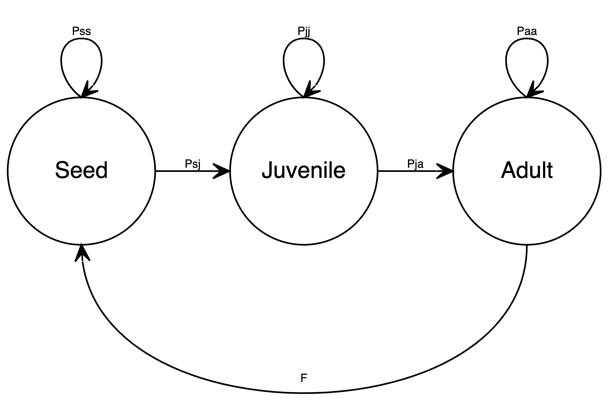

# DisturPloidy (v1.0.0)

**An Individual-Based Model (IBM) written in R.**

This model simulates plant populations over time in order to try and understand the prevalance of genome duplication (polyploidy) that we see in flowering plants (angiosperms). In particular it focuses on one specific question: *How does disturbance on a landscape affect the establishment of new polyploid plant species?*

## Installation

From your R console/script:

```R
install.packages("devtools")
library(devtools)
install_github("rozeykex/ploidy")
```

### If this repository is private

You'll need to setup a PAT token. See: `?install_github`.

## Basic usage

From your R console/script run `disturploidy()` to run a simulation. See `?disturploidy` for details on model parameters.

## Dependencies

The model requires Devtools, Tidyverse and Tictoc to run. They will be installed with disturploidy, but not loaded. Make sure to load them:

```
library(devtools)
library(tidyverse)
library(tictoc)
```

## Advanced usage

You can also set simulations running on a server without entering an R console. Running simulations with BASH commands means you can automate processes to continuously run simulations if you so desire.

Set up an R script which runs `disturploidy()`, then from terminal or a BASH script:

```BASH
Rscript path-to-your-file.R
```

Output will appear in `./data/`, unless otherwise specified with `logfilepath`, see: `?disturploidy`.

When you run simulations via `RScript` the directory the script is in acts as the working directory for R. Bear this in mind if you make edits or move data files etc.

## Output

By default, model data is stored to an environment object (every generation) which can be loaded on completion by doing `data(dploidy)` from your R console. This object is overwritten everytime you run `disturploidy()` but you can specify a `filename` and/or `logfilename` to store information more permanently. Alternatively you can set `return = T` to output the data straight to console or assign it to your own objects.

## The model system

The life cycle of the plants in this model aims to represent a simplified iteroparous perennial (many of which are polyploid in nature).



### Transition probabilities

#### Probability of remaining a seed (Pss)

`Pss = probability of seed survival`

#### Probability of transitioning from a seed to a juvenile (Psj)

`Psj = probability of germination`

#### Probability of remaining a juvenile (Pjj)

`Pjj = (growth rate * size < adult size threshold) * probability of juvenile survival`

The largest juveniles have the highest probabilities of survival.

#### Probability of transitioning from a juvenile to an adult (Pja)

`Pja = (growth rate * size >= adult size threshold) * probability of surviving competition`

Carrying capacity controls how many adults can survive on each landscape cell, and the largest adults have the highest probabilities of surviving competition.

#### Probability of remaining an adult (Paa)

`Paa = probability of adult survival * probability of surviving competition`

Adult survival probability can be reduced according to the occurance of inbreeding. As above, carrying capacity controls how many adults can survive on each landscape cell, and the largest adults have the highest probabilities of surviving competition.

#### Fecundity (F)

`F = number of ovules * probability of fertilisation`

Probability of fertilisation can be modified according to various mating rules:

- Uneven matching of gamete ploidy levels
- Selfing polyploid
- Selfing diploid
- Triploid maternal progenitor

Setting of these parameters controls some of the costs and benefits of being polyploid. For example, lowering the fertilisation probability of zygotes formed in the ovules of a triploid plant (with `triploid_mum_prob`) includes *triploid sterility*, by acting to reduce the seed output of triploids.

### Genetics

Genomes of individuals contain alleles that are random numbers (to 5 decimal places) from a uniform distribution between 0 and 100. These alleles are used to confer two separate traits to individuals.

- Growth rate
- Inbreeding induced mortality

The amount of benefit gained for these traits by polyploids can be controlled via the parameters `ploidy_growth_benefit` and `inbreeding_sensitivity` respectively. While the growth benefit directly controls how many of their additional growth rate alleles polyploids are allowed to contribute, inbreeding sensitivity works differently. Inbreeding alleles are checked for homozygosity as a measure of being inbred or not. Polyploids are naturally more resillient to homozygosity of alleles. For this trait `inbreeding_sensitivity` controls how much the mortality probability of inbred individuals should be increased.

#### Inheritance

Alleles are sampled (with replacement) from each loci of the parent genome to create gametes which fuse to become new offspring in the system. 

#### Genome duplication

We use a genome duplication rate of `0.01` to control the appearance of polyploids in the system - a much higher rate than that observed in nature (~10^-5^) in order to make the focal patterns easier to see. The parameter `ploidy_rate` can be maniplulated as you see fit.

#### Mutation

We use a mutation rate of `0.001` to control the appearence of new allele values in the system. Mutation causes a new random number (to 5 decimal places) from a uniform distribution between 0 and 100 to be chosen for that allele. This too is much higher than in nature (~10^-6^), but is realisticaly relative to our chosen rate of genome duplication (one order of magnitude lower).

### Dispersal

Seeds disperse in a king style movement, landing in any cell within 1 cell range of the maternal progenitor (they may also remain in the same cell). 

A second form of dispersal can also occur during clonal growth. Seed formation and germination are skipped to produce genetic clones that are the same size as newly initialised juveniles. Again the range of movement is the same king like motion, but clones are not grown on the same cell as their progenitor (only neighbouring ones).

Landscape boundaries wrap to produce a technically torus landscape with no edge.

### Disturbance

We varied the amount of disturbance in our simulations to see effects across a range of variables. The region of the landscape subject to disturbance can be modified via `disturbance_xlim`. The frequency of disturbance events and the resulting mortality can also be modified via `disturbance_freq` and `disturbance_mortality_pob` respectively. 

## Analysis

Our analysis is not included in the Rbuild for the package, but it is available here in the GitHub repository. Feel free to clone the project and rummage through the `analysis` folder to look at the simulations we ran and the data we obtained.

---

This project was funded by [The Genetics Society](http://www.genetics.org.uk/) as a Summer Studentship in 2019.
