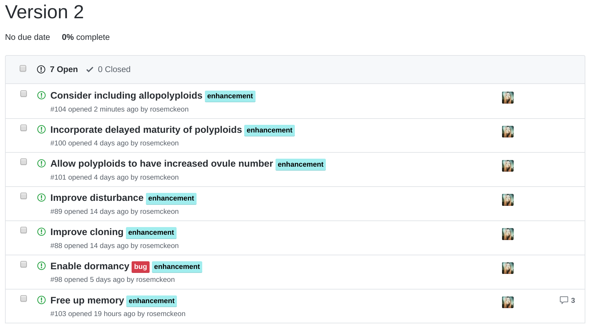
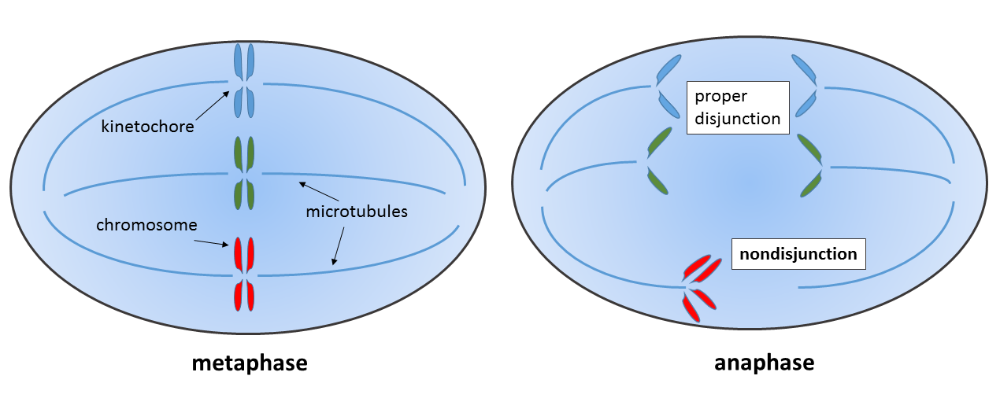

```{r setup, include=FALSE}
library(knitr)
library(tidyverse)
library(devtools)
library(disturploidy)

knitr::opts_chunk$set(echo = FALSE)

theme_colors <- list(
  white = "#fafafa",
  orange = "#ec8216",
  orange_faded = "#d7c7b9",
  grey = "#d4d8d9",
  black = "#000000"
)

data("dploidy_demo")

adults <- dploidy_demo$data$adults %>% 
  drop_na() %>%
  select(-sim) %>%
  tail()

genome <- adults[1, ]$genome[[1]]
```


## Individual-based models (IBMs) 

**IBMs emulate long-term evolutionary studies _in-silico_ by simulating biological systems over virtual time.**

- They allow for individual variation by representing all individuals in a population *explicitly*.

- This means fewer assumptions.

- Variables we're used to seeing in mathmatical models (like N) become *emergent properties* of the simulation.

- IBMs are tailor made to simulate a specific system.

# How does disturbance on a landscape affect the establishment of new polyploid plant species?


## What I thought the model had to do

```{r everything, out.width = "100%"}
include_graphics("graphs/everything.pdf")
```

**Basically, everything.**

## The Life Cycle

```{r life-cycle, out.width = "100%"}
include_graphics("graphs/life-cycle.pdf")
```

## A Generation

```{r not-so-much, out.width = "100%"}
include_graphics("graphs/not-so-much.pdf")
```

## Survival

```{r not-so-much-1, out.width = "100%"}
include_graphics("graphs/not-so-much-1.pdf")
```

## Germination

```{r not-so-much-2, out.width = "100%"}
include_graphics("graphs/not-so-much-2.pdf")
```

## Growth

```{r not-so-much-3, out.width = "100%"}
include_graphics("graphs/not-so-much-3.pdf")
```

## Competition

```{r not-so-much-4, out.width = "100%"}
include_graphics("graphs/not-so-much-4.pdf")
```

## Reproduction

```{r not-so-much-5, out.width = "100%"}
include_graphics("graphs/not-so-much-5.pdf")
```

## The Individuals

- ID
- X
- Y
- Genome
- Growth Rate
- Inbreeding Value
- Size
- Life Stage
- Ploidy Level

## The Individuals

\scriptsize
```{r individuals, echo=FALSE, message=FALSE, warning=FALSE}
kable(adults %>% select(-genome))
```

## The Genome

\scriptsize
```{r genome, echo=FALSE, message=FALSE, warning=FALSE}
kable(genome)
```

## Costs / Benefits

### Costs
Reduce polyploid fitness:

- **Triploid sterility** reduces fecundity.
- **Diploid pollen-swamping** reduces fecundity. 

### Benefits
Increase polyploid fitness:

- **Gigas-effects** reduce mortality.
- **Genetic buffering** reduces mortality.
- **Reversal of selfing inhibition ** increases fecundity.

# What did I find out?

## Results

Plots here!

# I learned even more too.

## Further work

```{r issues, out.width = "100%"}

```

# Any questions?

## Whole-Genome Duplication (WGD)

```{r non-disjunction, out.width = "100%"}

```

\footnotetext[1]{Wpeissner (2014). \textit{Non-disjunction} {[image]}. Available at: https://commons.wikimedia.org/w/index.php?curid=32332257}

## Benefit: Gigas-effects

`ploidy_growth_benefit`

- Can take a value between `0` and `1`. 
- Any value above `0` allows the contribution of additional alleles for growth rate and so simulates *gigas-effects*.
- Smaller adults have lower fitness.
- Polyploids will have an advantage if `ploidy_growth_benefit > 0`.

\footnotetext[1]{Tested: 0, 0.5, and 1.}

## Benefit: Genetic Buffering

`inbreeding_cost` 

- Can take a value between `0` and `1`.
- Any value above `0` will increase winter mortality if an individual is homozygous at a specified locus.
- Polyploids will have better survival probabilities than their diploid counterparts, because the chance of being homozygous at any given locus is far smaller.

\footnotetext[1]{Tested: 0, 0.5, and 1.}

## Benefit: Reversal of selfing inhibition

`selfing_polyploid_prob`

- Takes a value beteen `0` and `1`.
- Any value above `0` will give polyploids the ability to self-fertilise.
- This will increase fecundity, especially in the face of limited mate-choice (when `pollen_range` is low).
- Will convey a benefit to being polyploid when set to a value greater than that of diploids (default = `0`).

\footnotetext[1]{Tested: 0, and 1 with pollen range reduced from the full landscape to $\frac{2}{3}$ and $\frac{1}{3}$.}

## Cost: Triploid sterility

`triploid_mum_prob`

- Takes a value between `0` and `1`.
- Any value below `fertilisation_prob` will reduce the fecundity of triploids.
- Triploids in the model make 50/50 haploid/diploid gametes, so including triploid sterility also substantially reduces the chance of new polyploid lines arising.

\footnotetext[1]{Tested: 0, 0.375, and 0.75.}


## Cost: Diploid pollen-swamping

`uneven_matching_prob`

- Take a value between `0` and `1`.
- Acts to affect fertilisation success when gametes possessing different ploidy levels meet (ie: a haploid gamete and a diploid gamete).
- Any value below `fertilisation_prob` will reduce the fecundity of polyploids, especially when diploid density (an emergent property) is high, and when mate-choice is not limiting (when `pollen_range` is high).
- This will reduce the appearance of triploids.

\footnotetext[1]{Tested: 0, 0.375, and 0.75.}


## Disturbance

**Disturbance increases mortality over the survival period.**

`disturbance_freq` 
- Takes a whole number between `0` and max generation.
- Any value above `0` enables a chance of disturbance during the winter survival period.
- The value represents the likely mean number of generations between disturbances. 

`disturbance_mortality_prob` 
- Takes a value between `0` and `1`.
- Any value above `0` increases the chance of mortality during the survival period.

\footnotetext[1]{Tested: 0, 100, 50, 25, and 10.}
