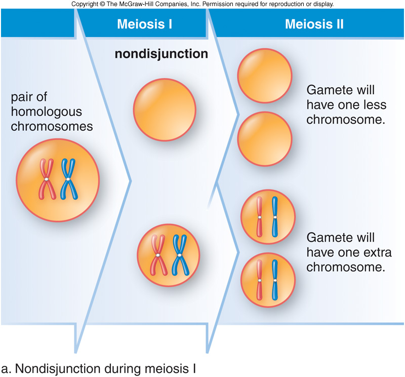
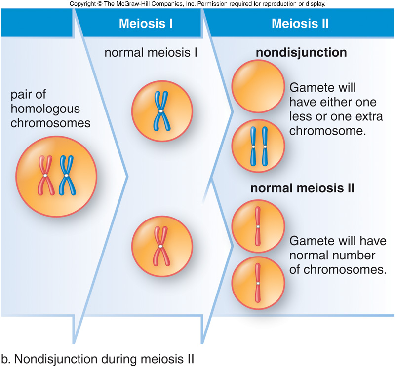

```{r setup, include=FALSE}
library(knitr)
library(tidyverse)
library(devtools)
library(DiagrammeR)
library(DiagrammeRsvg)
library(rsvg)
knitr::opts_chunk$set(echo = FALSE)

theme_colors <- list(
  white = "#fafafa",
  orange = "#ec8216",
  orange_faded = "#d7c7b9",
  grey = "#d4d8d9",
  black = "#000000"
)

data("dploidy_demo")
```


# How does disturbance on a landscape affect the establishment of new polyploid plant species?

## Non-disjunction

Polyploid organisms are caused by rare meiotic/mitotic catastrophies (eg: non-disjunction) which cause an uneven distribution of chromosomes between daughter cells.


When this happens during meiosis (in gametogenesis) gametes with unusual numbers of chromosomes are formed.

## Meiosis I



## Meiosis II



## Polyploidy

Genome duplication, is often a *saltational* event; a mutation so large that it can cause **instant speciation**. 

In plants it's estimated that the probability of polyploidisation occurring is around 10^-5^.

### How much diversity is it responisble for?
Speciations that coincide with genome duplication have been estimated:

- Around **15%** in angiosperms.
- And **30%** in ferns.

LOADS.

## Benefits

- Resistant to the deleterious effects of inbreeding.
- Able to flip the inhibition to selfing switch.
- Often display *gigas-effects*.
- Or, *hybrid vigour*.

## Costs

- Reduced access to compatible mates via outcrossing.
- Reduced fecundity due to *diploid pollenswamping*.
- Reduced fecundity due to *triploid sterility*.
- Extinction rates are high.

## But it's not rare

We've known about the prevelance of polyploidy in plants for over 100 years (it's also common in amphibians and fish).

- Around 25% of plants in nature are polyploid.
- Frequencies are especially high at altitude, where there has been glacial retreat, and **in recently disturbed areas**.
- Frequencies vary depending on taxa. Grasses are especially polyploid, while legumes tend not to be.
- Around 30% of our crop plants are polyploid.

# So why are polyploid plants so successful?

## Individual-based models (IBMs) 

IBMs allow for individual variation by representing all individuals in a population **explicitly**.

This means **fewer assumptions** about a population need to be made.

Variables we're used to seeing in mathmatical models (like **N**) become **emergent properties** of the simulation.

## What I thought the model had to do

```{r everything, out.width = "100%"}
grViz("graphs/everything.gv") %>%
  export_svg %>% 
  charToRaw %>% 
  rsvg_pdf("graphs/everything.pdf")

include_graphics("graphs/everything.pdf")
```

I thought nearly **every variable** in plant and community ecology, as well as **all the mechanisms** for inheritance and mutation had to be explicitly represented.

# Instead, I learned models work by keeping things really simple.

## All the model actually needed

```{r not-so-much, out.width = "100%"}
grViz("graphs/not-so-much.gv") %>%
  export_svg %>% 
  charToRaw %>% 
  rsvg_pdf("graphs/not-so-much.pdf")

include_graphics("graphs/not-so-much.pdf")
```

## Survival

```{r not-so-much-1, out.width = "100%"}
grViz("graphs/not-so-much-1.gv") %>%
  export_svg %>% 
  charToRaw %>% 
  rsvg_pdf("graphs/not-so-much-1.pdf")

include_graphics("graphs/not-so-much-1.pdf")
```

## Germination

```{r not-so-much-2, out.width = "100%"}
grViz("graphs/not-so-much-2.gv") %>%
  export_svg %>% 
  charToRaw %>% 
  rsvg_pdf("graphs/not-so-much-2.pdf")

include_graphics("graphs/not-so-much-2.pdf")
```

## Growth

```{r not-so-much-3, out.width = "100%"}
grViz("graphs/not-so-much-3.gv") %>%
  export_svg %>% 
  charToRaw %>% 
  rsvg_pdf("graphs/not-so-much-3.pdf")

include_graphics("graphs/not-so-much-3.pdf")
```

## Competition

```{r not-so-much-4, out.width = "100%"}
grViz("graphs/not-so-much-4.gv") %>%
  export_svg %>% 
  charToRaw %>% 
  rsvg_pdf("graphs/not-so-much-4.pdf")

include_graphics("graphs/not-so-much-4.pdf")
```

## Reproduction

```{r not-so-much-5, out.width = "100%"}
grViz("graphs/not-so-much-5.gv") %>%
  export_svg %>% 
  charToRaw %>% 
  rsvg_pdf("graphs/not-so-much-5.pdf")

include_graphics("graphs/not-so-much-5.pdf")
```

## The Life Cycle

```{r life-cycle, out.width = "100%"}
grViz("graphs/life-cycle.gv") %>%
  export_svg %>% 
  charToRaw %>% 
  rsvg_pdf("graphs/life-cycle.pdf")

include_graphics("graphs/life-cycle.pdf")
```

## The Individuals

\scriptsize
```{r individuals, echo=FALSE, message=FALSE, warning=FALSE}
adults <- dploidy_demo$data$adults %>% 
  drop_na() %>%
  select(-sim) %>%
  tail()

genome <- adults[1, ]$genome

kable(adults %>% select(-genome))
kable(genome[[1]])
```


