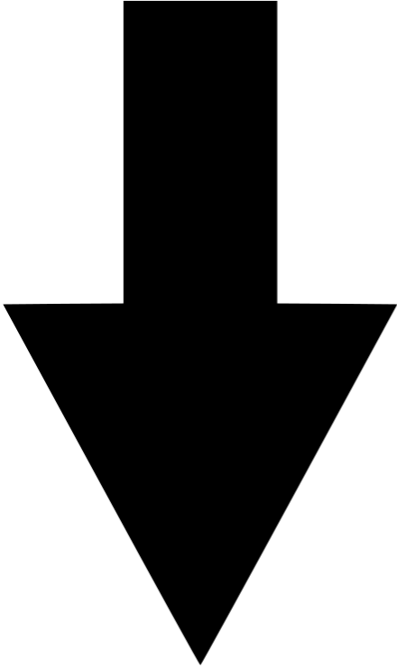
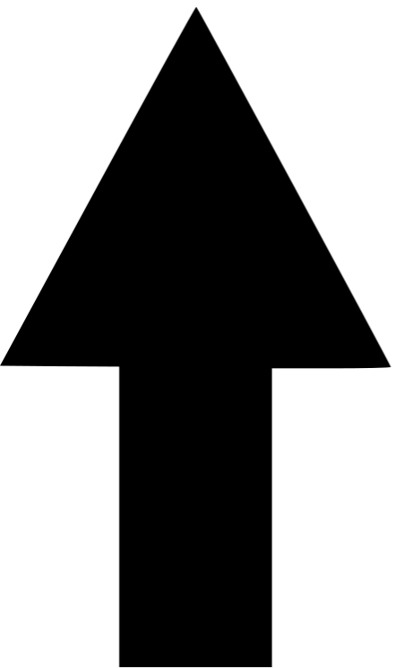

```{r setup, include=FALSE}
library(knitr)
library(kableExtra)
library(tidyverse)
library(devtools)

knitr::opts_chunk$set(
  echo = FALSE, message = FALSE, warning = FALSE
)

# theme_colors <- list(
#   white = "#fafafa",
#   orange = "#ec8216",
#   orange_faded = "#d7c7b9",
#   grey = "#d4d8d9",
#   black = "#000000"
# )
# 

costs_benefits <- tibble(
    Costs = c(
      "Triploid sterility",
      "Diploid pollen-swamping",
      ""
    ),
    Benefits = c(
      "Gigas-effects",
      "Genetic buffering",
      "Reversal of selfing inhibition"
    )
  )

sim_data <- readRDS("data/quick-test-1.rds")

adults <- sim_data$data$adults %>%
  select(-sim) %>%
  tail()

genome <- adults[1, ]$genome[[1]]

adults <- adults %>%
  mutate(genome = "---")
```


# How does disturbance on a landscape affect the establishment of new polyploid plant species?

## Individual-based models (IBMs) 

**IBMs emulate long-term evolutionary studies _in-silico_ by simulating biological systems over virtual time.**

- They allow for individual variation by representing all individuals in a population *explicitly*.

- Variables we're used to seeing in mathmatical models (like N) become *emergent properties* of the simulation.

- IBMs are often targeted to simulate a specific system, but can also be applied more broadly.


## What I thought the model had to do

```{r everything, out.width = "100%"}
include_graphics("graphs/everything.pdf")
```

**Basically, everything.**

## The Life Cycle

```{r life-cycle, out.width = "100%"}
include_graphics("graphs/life-cycle-simple.pdf")
```

## Costs/Benefits of Being Polyploid

```{r placeholder, out.height = "20%", fig.align = "right"}

```

```{r costs}
kable(
  costs_benefits %>% select(Costs),
  booktabs = T,
  align = "l"
  ) %>%
  kable_styling(
    full_width = F,
    position = "left"
  ) %>%
  column_spec(1, width = "15em", bold = T)
```

```{r arrow-down, out.height = "20%", fig.align = "left"}

```

## Costs/Benefits of Being Polyploid

```{r arrow-up, out.height = "20%", fig.align = "right"}

```

```{r benefits}
kable(
  costs_benefits,
  booktabs = T,
  align = "l"
  ) %>%
  kable_styling(
    full_width = F,
    position = "left"
  ) %>%
  column_spec(1, width = "15em") %>%
  column_spec(2, width = "15em", bold = T)
```

```{r arrow-down-2, out.height = "20%", fig.align = "left"}

```

## Costs/Benefits of Being Polyploid

\scriptsize
```{r costs-benefits}
kable(
  costs_benefits,
  booktabs = T,
  align = "l"
  ) %>%
  kable_styling(
    full_width = F,
    position = "center"
  ) %>%
  column_spec(1, width = "15em") %>%
  column_spec(2, width = "15em")
```

```{r, arrow, out.width = "70%", fig.cap = ""}

```

```{r life-cycle-small, out.height = "40%", fig.cap = ""}
include_graphics("graphs/life-cycle-simple.pdf")
```

## Model Flow

```{r model-flow, out.width = "100%"}
include_graphics("graphs/not-so-much-complete.pdf")
```

## Baseline Results

```{r null, out.width = "100%"}
include_graphics("plots/selfing_null-1.pdf")
```

## Reversal of selfing-inhibition

```{r selfing, out.width = "100%"}
include_graphics("plots/selfing_prob_ON-1.pdf")
```

## Genetic buffering against the deleterious affects of inbreeding

```{r inbreeding, out.width = "100%"}
include_graphics("plots/inbreeding_ON-1.pdf")
```

## Gigas effects which increase growth

```{r growth-benefit, out.width = "100%"}
include_graphics("plots/growth-benefit_ON-1.pdf")
```

## Disturbance when polyploids have reversal of selfing-inhibition

```{r selfing-disturbance, out.width = "100%"}
include_graphics("plots/selfing-ON-disturbance-1.pdf")
```

## Disturbance when polyploids buffer the deleterious affects of inbreeding 

```{r inbreeding-disturbance, out.width = "100%"}
include_graphics("plots/inbreeding-ON-disturbance-1.pdf")
```

## Disturbance when polyploids have increased growth rate

```{r growth-benefit-disturbance, out.width = "100%"}
include_graphics("plots/growth-benefit-ON-disturbance-4.pdf")
```

## Summary / Questions

**Disturbance really does play a key role in the establishment of polyploids within plant populations.**

Try it for yourself:

```R
library(devtools)
install_github("rosemckeon/ploidy")
library(disturploidy)
?disturploidy
```

\LARGE
https://github.com/rosemckeon/ploidy

## The Individuals

```{r individuals}
kable(
  adults, "latex", 
  booktabs = T,
  digits = 3,
  align = "c"
  ) %>%
  kable_styling(
    full_width = T,
    font_size = 7
  ) %>%
  column_spec(c(1:3, 7), width = "1.25em")
```

## The Genome

```{r genome}
kable(
  genome,
  booktabs = T, 
  digits = 5, 
  align = "c"
  ) %>%
  kable_styling(
    full_width = F,
    position = "center"
  )
```

## The Landscape

```{r landscape, fig.cap="", out.width="60%"}
include_graphics("images/donut.png")
```

## Whole-Genome Duplication (WGD)

```{r non-disjunction, out.width = "100%"}
include_graphics("images/nondisjunction.png")
```

\footnotetext[1]{Wpeissner (2014). \textit{Non-disjunction} {[image]}. Available at: https://commons.wikimedia.org/w/index.php?curid=32332257}

## Benefit: Gigas-effects

`ploidy_growth_benefit`

- Can take a value between `0` and `1`. 
- Any value above `0` allows the contribution of additional alleles for growth rate and so simulates *gigas-effects*.
- Smaller adults have lower fitness.
- Polyploids will have an advantage if `ploidy_growth_benefit > 0`.

## Benefit: Genetic Buffering

`inbreeding_cost` 

- Can take a value between `0` and `1`.
- Any value above `0` will increase winter mortality if an individual is homozygous at a specified locus.
- Polyploids will have better survival probabilities than their diploid counterparts, because the chance of being homozygous at any given locus is far smaller.

## Benefit: Reversal of selfing inhibition

`selfing_polyploid_prob`

- Takes a value beteen `0` and `1`.
- Any value above `0` will give polyploids the ability to self-fertilise.
- This will increase fecundity, especially in the face of limited mate-choice (when `pollen_range` is low).
- Will convey a benefit to being polyploid when set to a value greater than that of diploids (default = `0`).

## Cost: Triploid sterility

`triploid_mum_prob`

- Takes a value between `0` and `1`.
- Any value below `fertilisation_prob` will reduce the fecundity of triploids.
- Triploids in the model make 50/50 haploid/diploid gametes, so including triploid sterility also substantially reduces the chance of new polyploid lines arising.

## Cost: Diploid pollen-swamping

`uneven_matching_prob`

- Take a value between `0` and `1`.
- Acts to affect fertilisation success when gametes possessing different ploidy levels meet (ie: a haploid gamete and a diploid gamete).
- Any value below `fertilisation_prob` will reduce the fecundity of polyploids, especially when diploid density (an emergent property) is high, and when mate-choice is not limiting (when `pollen_range` is high).
- This will reduce the appearance of triploids.

## Disturbance

`disturbance_freq` 

- Takes a whole number between `0` and max generation.
- Any value above `0` enables a chance of disturbance during the winter survival period.
- The value represents a `1/disturbance_freq` chance of disturbance which is applied every winter. 

`disturbance_mortality_prob` 

- Takes a value between `0` and `1`.
- Any value above `0` increases the chance of mortality during the survival period by that proportion.

## Further work

```{r issues, out.width = "100%"}
include_graphics("images/version-2-issues.png")
```

